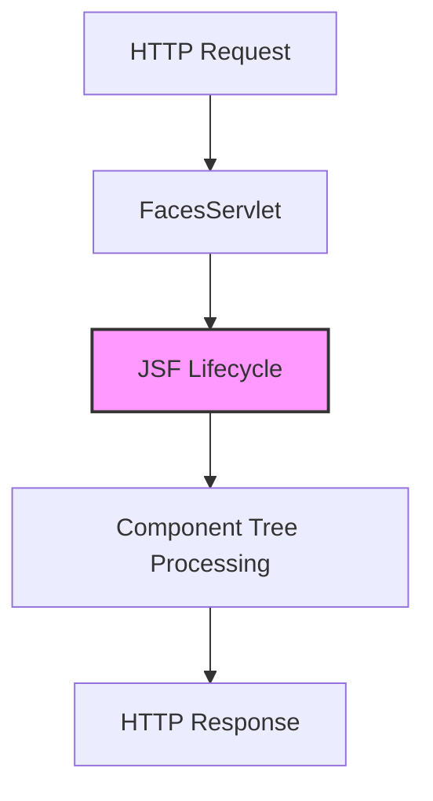
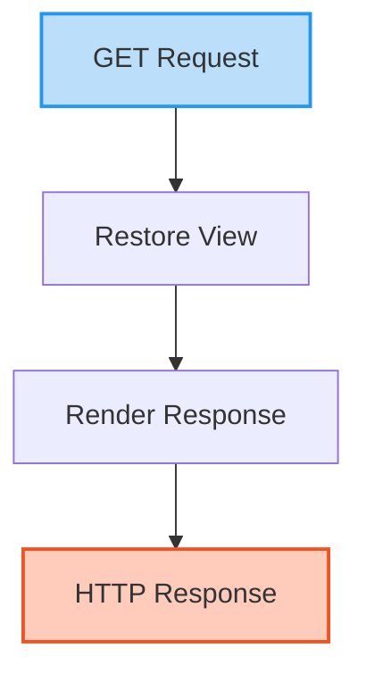
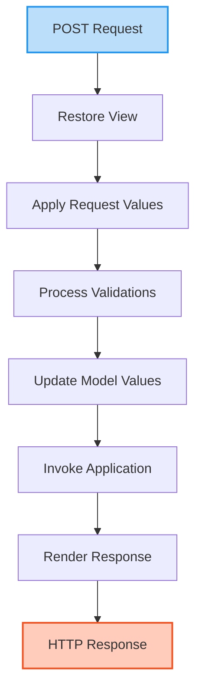
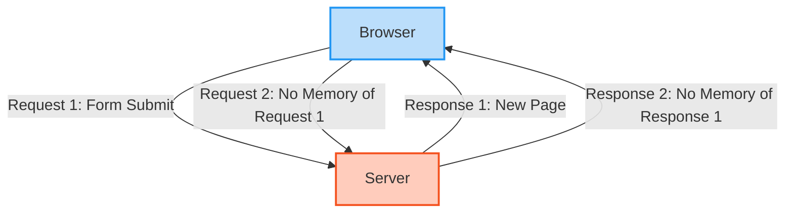
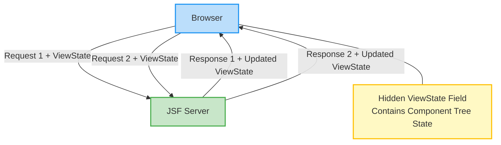
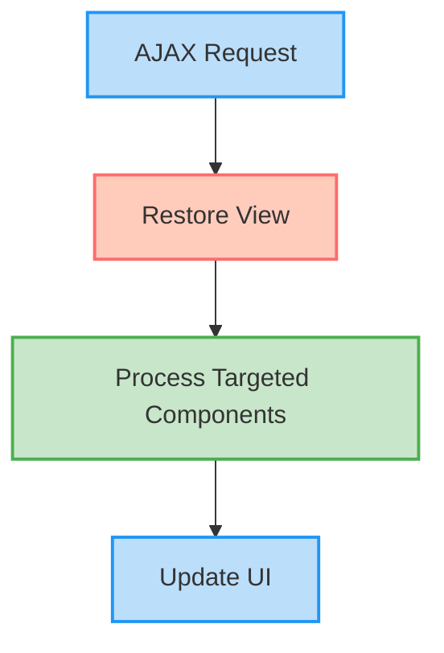
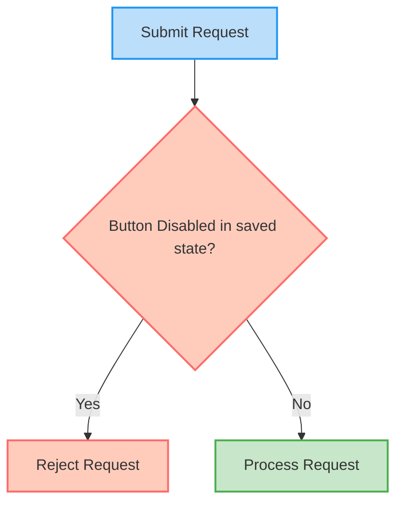
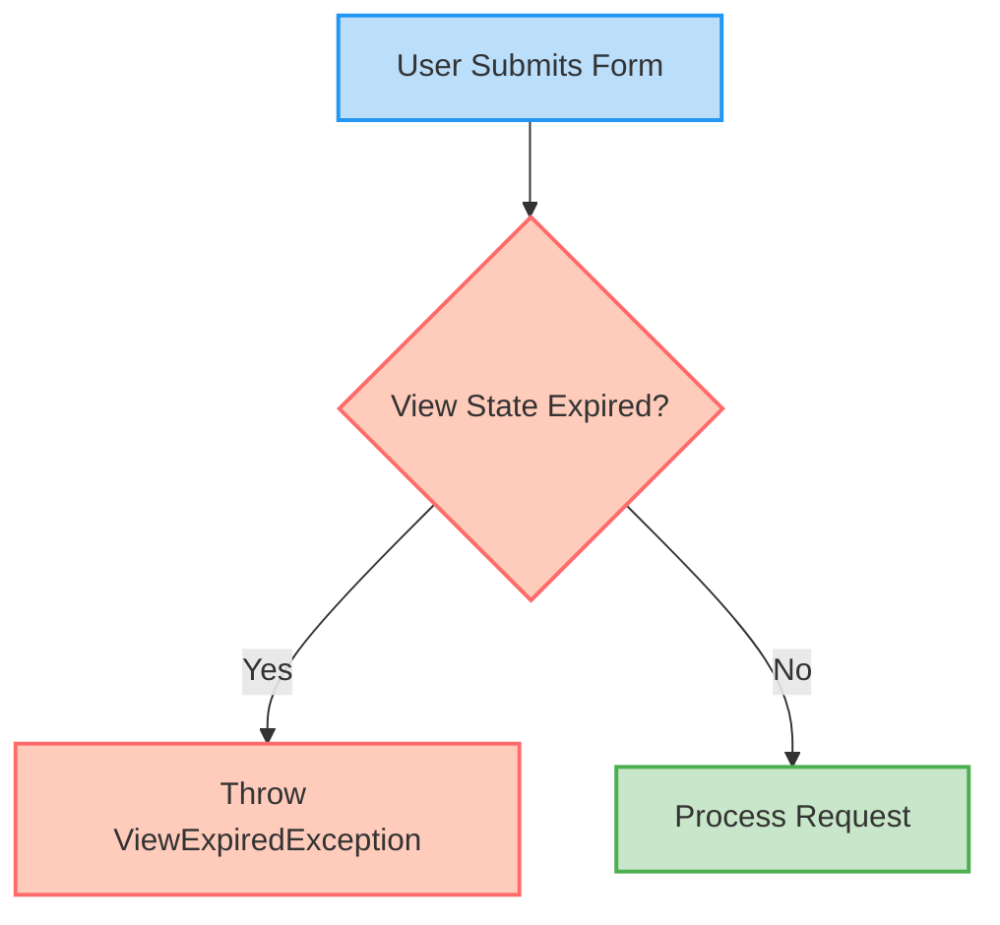

# JSF Lifecycle and State Management
A deep dive into how JSF processes requests and maintains state

---

# Overview

- Understanding the JSF Lifecycle
  - GET Requests vs POST Requests flow
  - The Six Lifecycle Phases
- Controlling the Lifecycle
  - `Immediate` Attribute
  - Phase Listeners
- JSF State Management
  - Why State Management Matters
  - Server-side vs Client-side State Saving
  - Handling `ViewExpiredException`

<style>
h1 {
  background-color: #2B90B6;
  background-image: linear-gradient(45deg, #4EC5D4 10%, #146b8c 20%);
  background-size: 100%;
  -webkit-background-clip: text;
  -moz-background-clip: text;
  -webkit-text-fill-color: transparent;
  -moz-text-fill-color: transparent;
}
</style>
---
layout: two-cols
---

# Introduction to JSF Lifecycle


- JSF follows a **six-phase lifecycle** to process requests and render responses.
- The lifecycle ensures proper handling of user input, validation, model updates, and UI rendering.


::right::

<div class="ml-6">
<v-click>



</v-click>
</div>


---
layout: two-cols
---
# JSF Request Types

## GET Request (Initial)


::right::

<div class="ml-6 mt-8">



</div>

---
layout: two-cols
---
# JSF Request Types

## POST Request (Postback)

::right::

<div class="ml-6">


</div>


---

# Phase 1: Restore View

- **Initial Request (GET)**:
  - Creates an empty view, since there's no `UIViewRoot` to restore
  - Advances to Render Response phase

- **Postback Request (POST)**:
  - Restores component tree from ViewState
  - Prepares all components for processing


---

# Phase 2: Apply Request Values

- Extracts values from request parameters
- Stores extracted values in components locally
- Queues ValueChangeEvents

---

# Phase 3: Process Validations

- Converts string values to expected types
- Validates component values
  - JSF built-in validators (required, length, etc.)
  - Bean validation (javax.validation)
  - Custom validators
- If validation fails:
  - Adds error messages to FacesContext
  - Skips to Render Response phase

<v-click>

```html
<h:inputText value="#{user.email}" id="email">
    <f:validateRegex pattern="^[a-zA-Z0-9._%+-]+@[a-zA-Z0-9.-]+\.[a-zA-Z]{2,}$" />
    <f:ajax event="blur" render="emailError" />
</h:inputText>
<h:message for="email" id="emailError" style="color:red" />
```

</v-click>

<!-- Advantage of validation in this phase instead of backing bean methods is Jsf/bean validation runs validation for all the components even if one of them fails -->

---

# Phase 4: Update Model Values

- Component values are set into model properties
  - Initiates the backing bean (RequestScoped)
  - Updates backing bean or entity properties
  - Type conversion is applied where needed

<v-click>

```java
// Inside JSF implementation (simplified)
public void updateModelValues(FacesContext context) {
    for (UIComponent component : getAllInputComponents()) {
        if (component instanceof UIInput) {
            UIInput input = (UIInput) component;
            ValueExpression ve = input.getValueExpression("value");
            if (ve != null) {
                // Set the component's local value into the model
                ve.setValue(context.getELContext(), input.getLocalValue());
                input.setValue(null); // Clear local value
            }
        }
    }
}
```

</v-click>

---

# Phase 5: Invoke Application

- Executes action methods and listeners
- Processes navigation cases depending on the return type of action method
  - `return String` → navigate to new page by creating new request (ViewScoped bean recreated)
  - `return void` → stay on same page and proceeds to next phase (ViewScoped bean persists) 
  - `return empty String` → refresh current page (ViewScoped bean recreated)
- Queued events are processed (button clicks, value change events, etc.)

<v-click>

```java
public String login() {
    if (userService.authenticate(username, password)) {
        return "dashboard?faces-redirect=true"; // Navigation
    }
    FacesContext.getCurrentInstance().addMessage(null, 
        new FacesMessage(FacesMessage.SEVERITY_ERROR, "Invalid credentials", null));
    return ""; // Stay on same page
}
```

</v-click>

---

# Phase 6: Render Response

- Renders component tree into HTML
- Saves the state of components for future request processing
- Completes the response

<v-click>

```html
<!-- Rendered output will include ViewState -->
<form id="j_id1" name="j_id1" method="post" action="/app/login.xhtml" enctype="application/x-www-form-urlencoded">
    <!-- Form components -->
    <!-- Hidden field containing the view state -->
    <input type="hidden" name="jakarta.faces.ViewState" id="j_id1:jakarta.faces.ViewState:0" 
           value="-5595324239867351894:6754026291940545952" autocomplete="off" />
</form>
```

</v-click>

---

# The `immediate` Attribute

Alters normal lifecycle processing:

## For Input Components:
- Validates during **Apply Request Values** instead of Process Validations
- Useful when you want to prioritize validation for specific inputs
- Example: Username field in a large registration form

<v-click>

## For Command Components:
- Action methods execute in **Apply Request Values**
- **Process validations**, **Update model values**, and **Invoke Application** phases are skipped
- Skips conversion and validation of non-immediate input components
- Useful for "Cancel" or "Back" buttons in the form
- Get the non-converted and non-validated input value using `component.getSubmittedValue()`

</v-click>

---

# Quiz: Using `immediate` Attribute

<div class="bg-gray-100 px-5 py-1 rounded-lg">
<p>You need to reuse a login form for both login and "forgot password" functionality:</p>

<ul>
<li>The "Login" button should validate both username and password</li>
<li>The "Forgot Password" button should only validate the username</li>
</ul>

<p class="font-bold">How would you implement this?</p>
</div>

<v-click>

## Solution

```html
<h:inputText id="username" value="#{loginBean.username}" immediate="true" required="true" />
<h:inputSecret id="password" value="#{loginBean.password}" required="true" />

<h:commandButton value="Login" action="#{loginBean.login}" />
<h:commandButton value="Forgot Password" action="#{loginBean.forgotPassword}" immediate="true" />
```

- Username validated early (immediate="true")
- Forgot Password button with immediate="true" skips password validation
- Login button validates both fields

</v-click>

---
layout: section
---

# JSF State Management

---

# Stateful JSF

<div class="grid grid-cols-2 gap-4">
<div>

## HTTP is Stateless
- Each request is completely independent
- No component state preservation



</div>
<div>

## JSF is Stateful

- Preserves entire UI component tree state
- Maintains form inputs and button states



</div>
</div>

<!-- Speaker Notes: 
- In HTTP, the server treats each request as brand new with no memory of previous interactions
- JSF builds on top of HTTP by adding a state management layer (ViewState)
- JSF's ViewState can be stored client-side (in a hidden field) or server-side (with just a reference ID sent to client)
- This mechanism allows for rich UI components that maintain their state across the request-response cycle
-->

---

# Why JSF Saves State

<div class="grid grid-cols-2 gap-2">
<div>

## Form Processing
- **Validate the data**.
- **Update the model** (backing beans).
- **Re-render the form** with the same values and validation message if validation fails.


</div>
<div>

## Dynamic Changes
- The component tree can change during **AJAX updates**.
- JSF does **NOT reload the whole page**.
- Restores the view from `ViewState` and processes only **targeted components**.


</div>
</div>


---

# Why JSF Saves State (continued)

<div class="grid grid-cols-2 gap-2">
<div>

## Lifecycle Handling
- State provides information on:
   - Request parameters
   - Converters/validators
   - Bound managed bean properties

</div> 

<div>

## Security Protection
- Prevents tampered requests (e.g., submitting a disabled button).
- Validates against the saved state during the Apply Request Values Phase.





</div>
</div>


<!-- - Example: -->
   <!-- - If a button was disabled in the original state but the request includes a submission for it, JSF rejects the request. -->


---

# How JSF's Saved State Enhances Security

JSF prevents tampered requests through:

<v-click>

- Re-evaluation of component attributes during lifecycle
  - `rendered`, `disabled`, and `readonly` states are checked
  - Prevents activation of disabled components

</v-click>

<v-click>

- Validation of submitted values
  - `UISelectOne` and `UISelectMany` validate against available options
  - Prevents injection of unauthorized values

</v-click>

<v-click>

- Protection of component tree structure
  - Prevents addition or removal of components via tampered requests
  - Ensures only valid UI interactions are processed

</v-click>


---

# The ViewState


- **Hidden Form Field**: `jakarta.faces.ViewState`
- **Contains**: Serialized component tree state (client-side) or reference ID (server-side)
- **Used During**: Restore View phase to rebuild the component tree

---

# Server-Side vs Client-Side State Saving

<div class="grid grid-cols-2 gap-4 mt-4">
<div>

## Server-Side
- Stores state in session
- Lower bandwidth usage
- Higher server memory usage
- Protected in session
- Risk of ViewExpiredException
- Default in most implementations

```xml
<!-- web.xml configuration -->
<context-param>
    <param-name>jakarta.faces.STATE_SAVING_METHOD</param-name>
    <param-value>server</param-value>
</context-param>
```

</div>
<div>

## Client-Side
- Serialized state in form's hidden field
- Higher bandwidth usage
- Lower server memory usage
- Encrypted but exposed to client
- Prevents ViewExpiredException
- Better for clustered environments

```xml
<!-- web.xml configuration -->
<context-param>
    <param-name>jakarta.faces.STATE_SAVING_METHOD</param-name>
    <param-value>client</param-value>
</context-param>
```

</div>
</div>

<!-- ---

# Server-Side vs Client-Side State Saving

| Aspect | Server-Side | Client-Side |
|--------|------------|-------------|
| Storage Location | Session with ViewState reference | Hidden field in HTML |
| Memory Usage | High (increases with users) | Low (no server storage) |
| Bandwidth | Low (small reference) | High (serialized state) |
| Security | Protected in session | Encrypted but client-exposed |
| Performance | Better page load time | Slower due to serialization |
| ViewExpiredException | Yes (session timeout) | No (state always available) |
| Configuration | Default setting | Opt-in setting | -->

---
zoom: 0.8
---

# ViewExpiredException in JSF

<div class="grid grid-cols-2 gap-10 mt-4">
<div>

## What is `ViewExpiredException`?
- Occurs when JSF cannot restore the **saved state** of a page.
- when server side state (component tree) gets invalidated and user tries to do a postback request on the same page


<v-click>

## Common causes:
- **Session Timeout:** Form left open too long; session expires before submission.
- **Browser Navigation:** User submits, navigates away, then returns and resubmits.
- **Server State Limits:** Server purges old ViewState when limits are exceeded.
   
</v-click>
</div>

<div>


</div>

</div>


<!-- Common causes
1. Session Timeout:
   - User fills out a form but leaves it open too long
   - Session expires on the server
   - When user submits, the ViewState cannot be found

2. Browser Navigation Issues:
   - User submits form and navigates to success page
   - Uses browser back button to return to previous page
   - Submits the form again, but the ViewState is no longer valid

3. Server-Side State Limits:
   - Server reaches maximum number of saved views
   - Oldest views are purged, causing exceptions -->

---

# ViewExpiredException in JSF (continued)


## Prevention & Handling:
- Use client-side state saving for critical forms
- Add session keep-alive for long forms
- Implement proper exception handling
   ```java
   <error-page>
      <exception-type>jakarta.faces.application.ViewExpiredException</exception-type>
      <location>/viewExpired.xhtml</location>
   </error-page>
   ```

- Use libraries like OmniFaces for better handling


---

# Demo: Inspecting JSF Lifecycle

<div class="grid grid-cols-2 gap-4">
<div>

## Phase Listener Implementation

```java

public class LifecycleLogger implements PhaseListener {
    @Override
    public void beforePhase(PhaseEvent event) {
        System.out.println("Before phase: " + 
            event.getPhaseId());
    }
    
    @Override
    public void afterPhase(PhaseEvent event) {
        System.out.println("After phase: " + 
            event.getPhaseId());
    }
    
    @Override
    public PhaseId getPhaseId() {
        return PhaseId.ANY_PHASE;
    }
}
```

</div>
<div>

## faces-config.xml Registration

```xml
<lifecycle>
    <phase-listener>
        com.example.LifecycleLogger
    </phase-listener>
</lifecycle>
```

## Debug Output (Initial Request)
```
Before phase: RESTORE_VIEW 1
After phase: RESTORE_VIEW 1
Before phase: RENDER_RESPONSE 6
After phase: RENDER_RESPONSE 6
```

## Debug Output (Postback)
```
Before phase: RESTORE_VIEW 1
After phase: RESTORE_VIEW 1
Before phase: APPLY_REQUEST_VALUES 2
After phase: APPLY_REQUEST_VALUES 2
...
```

</div>
</div>


---
layout: center
class: text-center
---

# Thank You!

Any questions?

---
layout: end
---